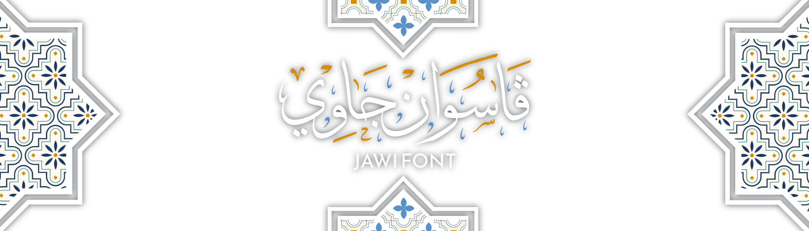

[ملايو جاوي](README_ms.md) // [Melayu](README.md)

    </img>

A small project in an effort to dignify [Jawi][wikijawi] and Malay Arabic script.
Starting in 2.872, the [Pegon][wikipegon] and its family will also try to be supported so as not to be lost to time.

Hopefully this project makes it a little easier for designers from adding the dots manually themselves and hopefully may also become a reference for
type designers who are interested in adding Jawi-Pegon characters to their fonts.

[wikijawi]: https://en.wikipedia.org/wiki/Jawi_script
[jawifont]: https://github.com/jawi-mnh48/jawifont/blob/master/README_ms.md
[gdrive]: https://drive.google.com/drive/u/2/folders/1hIquuEN_Y7KD8_CUuR2vzKUz52kVdxa9
[kkMNH]: https://github.com/jawi-mnh48/jawi-keyboard
[kkUKM]: https://sites.google.com/a/jawiware.org/www/keyboard-untuk-jawi
[corakarab]: https://www.freepik.com/free-vector/arabic-ornamental-background-paper-style_13109366.htm
[wikipegon]: https://en.wikipedia.org/wiki/Pegon_script
