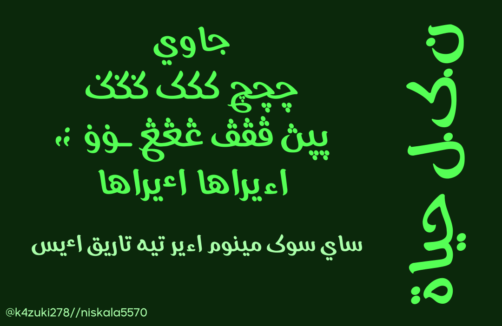
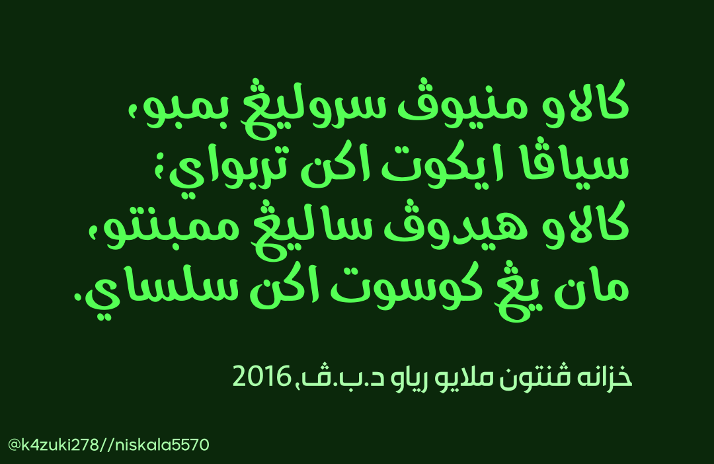

# Hayah
* Menambah huruf Nya(ڽ), Kaf(ک), Ga(ݢ), Kaf Titik Atas (ڬ), Kaf Titik Bawah (ࢴ), Kaf Tiga Titik Bawah (ڮ), Nga(ڠ), Va(ۏ), Hamzah Tiga Suku(ٴ), Koma Cermin(⹁) dan Koma Cermin Bertitik(⁏).
* Menambah garis pada Gaf Parsi (گ)
* Menggantikan tanda kurung.
* Membesarkan sedikit titik huruf Ca.

## Contoh Penggunaan

