[ملايو جاوي](README_ms.md) // [English](README_en.md)

# Carta Huruf (Dalam Pembikinan)

## Huruf Jawi
| Nama                        	| Gambar                          	| Aksara 	| Kod  	| Rumi 	| Nota                                                                                                                                                                                                 	|
|-----------------------------	|---------------------------------	|--------	|------	|------	|-----	|
| Ca (Ha Nipis Bertitik Tiga) 	| 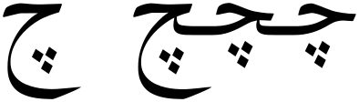              	| چ      	| 0686 	| C    	|                                                                                                                                                                                                      	|
| Nga (Ain Bertitik Tiga)     	| 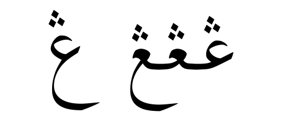             	| ڠ      	| 06A0 	| Ng   	|                                                                                                                                                                                                      	|
| Pa (Fa Bertitik Tiga)       	| 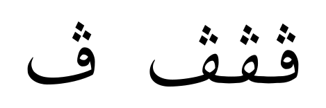              	| ڤ      	| 06A4 	| P    	|                                                                                                                                                                                                      	|
| Kaf (Keheh)                 	| 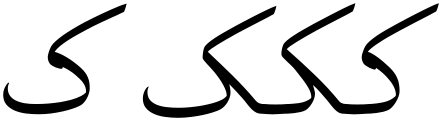             	| ک      	| 06A9 	| K    	|                                                                                                                                                                                                      	|
| Ga (Keheh Bertitik Satu)    	| 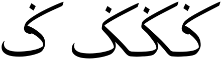              	| ݢ      	| 0762 	| G    	|                                                                                                                                                                                                      	|
| Nya (Nun Bertitik Tiga)     	| 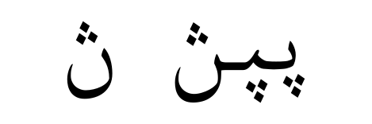             	| ڽ      	| 06BD 	| Ny   	|                                                                                                                                                                                                      	|
| Va (Wau Bertitik Satu)      	| 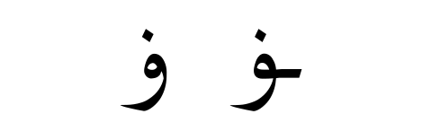              	| ۏ      	| 06CF 	| V    	|                                                                                                                                                                                                      	|
| Hamzah Tiga Suku            	| 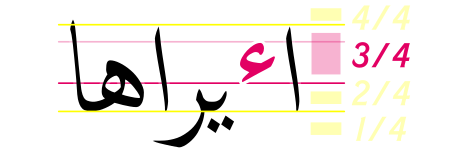 	| ٴ      	| 0674 	| -    	| Peggunaan untuk Hamzah Tinggi sudah tak disarankan, maka unicode padankan dengan Hamzah Tiga Suku.[^hamzahtinggi] Tetapi ada usulan yang baharu untuk menambahnya pada 11 Jan 2022[^hamzahtigasuku]. 	|
| Hamzah Berumah Ya           	| 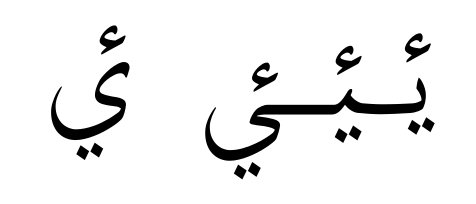       	| ࢨ      	| 08A8 	| I    	|                                                                                                                                                                                                      	|

[^hamzahtinggi] 

[^hamzahtigasuku] [Unicode L2/L2022/22051](https://www.unicode.org/L2/L2022/22051-jawi-hamza.pdf)

## Huruf Jawi Tambahan
| Nama         | Gambar | Kod | Nota |
|--------------|------------|--------------|--------------|
| Wau Bervi | 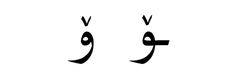 | **0648+065A** / 06C6 | Saksi O (Gaya Niskala) |
| Ya Bervi | 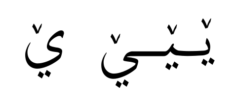 | **064A+065A** / 06CE | Saksi E Taling (Gaya Niskala) |
| Ya Bertitik Dua Menegak | 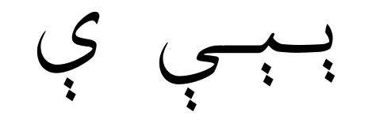 | 06D0 | Saksi E Taling (Cadangan Za'ba)|

## Huruf Pegon/Arab Melayu
| Nama         | Gambar | Kod|  Rumi | Nota |
|--------------|------------|--------------|--------------|--------------|
| Dha (Dal Bertitik Tiga) | 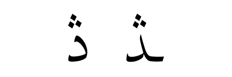  | 068E | Dh | Pegon |
| Tha (Ta Bertitik Tiga) | 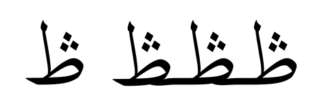  | 069F | Th | Pegon |
| Gaf (Kaf Bertitik Tiga Bawah) |   | 06AE | G | Pegon |
| Nya (Ya Bertitik Tiga Bawah) |   | 06AE | G | Pegon |

## Huruf Jawi Campa
| Nama                        | Gambar | Aksara | Kod       | Rumi | Nota |
|-----------------------------|--------|--------|-----------|------|------|
| Alif Jazam                  |        | اۡ      | 0627+06E1 |      |      |
| Alif Bertitik Tiga Atas     |        | اۛ      | 0627+06DB |      |      |
| Ha Pedas Bertitik Tiga Atas |        | څ      | 0685      | nj   |      |
| Fa Titik Satu Bawah         |        |        | 06A2      |      |      |
| Dal Tiga Titik Atas         |        |        | 068E      |      |      |
| Wau Bervi Terbalik Atas     |        |        | 06C9      |      |      |
| Wau Bervi                   |        |        | 06C6      |      |      |
| Ye Bervi Bawah              |        |        |           |      |      |
| Ye Bervi Terbalik Bawah     |        |        |           |      |      |

## Tanda Baca Jawi
| Nama         | Gambar | Kod | Nota |
|--------------|------------|--------------|--------------|
| Koma Jawi | 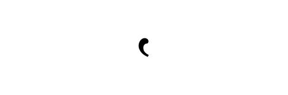 | 2E41 | |
| Koma Bernoktah Jawi | 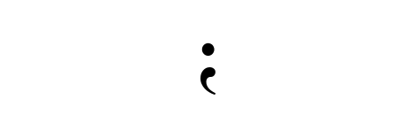 | 204F | |
| Tanda Soal Arab | 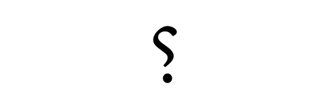 | 061F | |

### Titik - Tanda
> ttxxa tnxVxa
>
> contohnya: ttx3xa
>
> TODO

| Nama             | Gambar | Kod           | Maksud |
| ------- | ---------------- | ---- | ------------- |
| ttx1xa         |                  | FBB2     | Titik 1 Atas               |
| ttx2xa         |                  | FBB4     | Titik 2 Atas               |
| ttx3xa         |                  | FBB6     | Titik 3 Atas               |
| ttx3Axa        |                  | FBB8     | Titik 3 Atas               |
| ttx1xb         |                  | FBB3     | Titik 1 Bawah              |
| ttx2xb         |                  | FBB5     | Titik 2 Bawah              |
| ttx3xb         |                  | FBB7     | Titik 3 Bawah              |
| ttx3Axb        |                  | FBB9     | Titik 3 Bawah              |
| ttx4xa         |                  | FBBA     | Titik 4 Atas               |
| ttx4xb         |                  | FBBB     | Titik 4 Bawah              |
